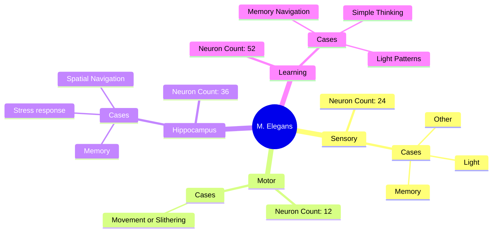

## The Worm Project
*Also Known As **M. Elegans** meaning **Mini Elegans***

This is a Fictional Animal For a Connectome.
The Worm has **124 Neurons** and has 4 areas:
1. **Sensory**
2. **Motor**
3. **Hippocampus**
4. **Learning**

 ### About the VirtualAnimalProject
The VirtualAnimalProject is a GitHub Organization dedicated to making Fictional and Digital Animals have Connectomes, From Ideas from the community and the staff.
 ## Rules For Future Animal Repositories
  • No Eldritch Horror or Fantasy Animals
  • No Real Animals
  • Only Scientifically Plausible Fictional Animals.

## Current Worm Project Diagram

